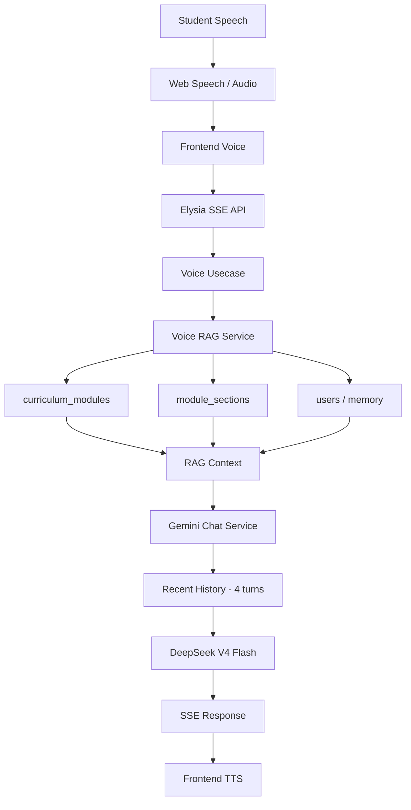
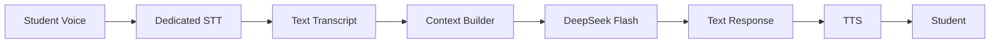
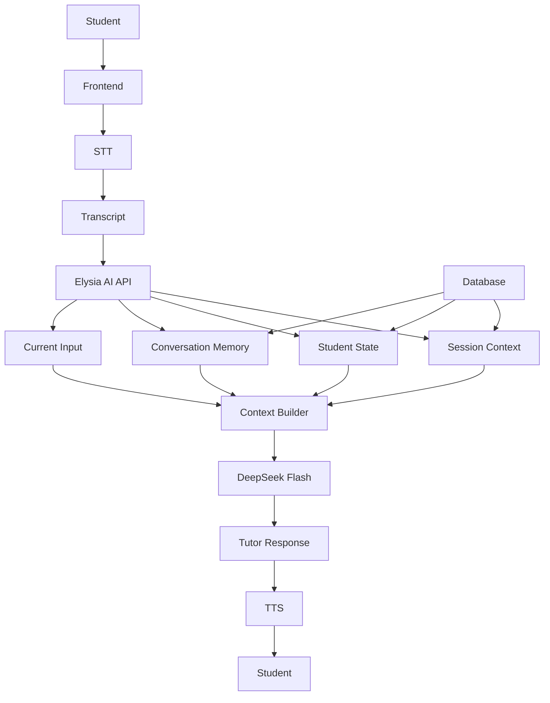

# Eddys AI — Revisian Arsitektur AI & Efisiensi Token

## Tujuan

Revisi ini berfokus pada hasil audit arsitektur Eddys AI, terutama masalah penggunaan token yang mencapai sekitar **31K input tokens** pada request tertentu.

### Temuan utama

Penyebab utama 31K token bukan conversation history, melainkan **audio Base64 yang dikirim ke model text-only**. Audio 30–60 detik dapat berubah menjadi string Base64 sangat besar, lalu diperlakukan sebagai teks oleh gateway/model sehingga menghasilkan puluhan ribu input tokens.

Temuan audit juga menunjukkan bahwa voice conversation melakukan beberapa query database berulang pada setiap turn.

---

# 1. Arsitektur CURRENT



## Current voice flow

1. User berbicara di browser.
2. Frontend membentuk history dan mengirim request ke `/api/voice/turn-stream`.
3. Elysia menerima request dan menjalankan `streamVoiceTurnUsecase`.
4. `voiceRagService` mengambil curriculum, module sections, dan student memory.
5. Context digabungkan dengan persona Mr. Khoirul.
6. History dipotong menjadi 4 turn terakhir.
7. Request dikirim ke `deepseek-v4-flash:free`.
8. Response di-stream melalui SSE.
9. Frontend memainkan audio TTS.

---

# 2. ROOT CAUSE 31K TOKENS

## Masalah kritis

Flow evaluasi/transkripsi audio saat ini mengirim:

```text
audio
↓
Base64
↓
OpenAI-compatible chat/completions
↓
deepseek-v4-flash
```

Model yang digunakan adalah text model, bukan dedicated audio model.

Akibatnya Base64 dapat diperlakukan sebagai teks.

Contoh konseptual:

```text
30–60 detik audio
        ↓
100K+ karakter Base64
        ↓
Tokenizer
        ↓
~31K input tokens
```

### Dampak

- Token input sangat besar.
- Biaya AI meningkat.
- Request payload besar.
- Latency meningkat.
- Tidak efisien untuk voice feature.

---

# 3. SOLUSI UTAMA — PISAHKAN STT DAN LLM

Jangan kirim audio Base64 langsung ke text LLM.

Gunakan pipeline:



## Prinsip

### STT

Tugas:

```text
Audio → Text
```

### LLM

Tugas:

```text
Text + Context → Tutor Response
```

### TTS

Tugas:

```text
Tutor Response → Audio
```

Dengan demikian audio tidak lagi masuk ke text LLM.

---

# 4. RECOMMENDED CONTEXT ARCHITECTURE

Context AI harus dipisahkan menjadi:

```text
STATIC CONTEXT
+
SESSION CONTEXT
+
STUDENT STATE
+
RECENT CONVERSATION
+
CURRENT INPUT
```

## Static Context

Contoh:

- Tutor persona
- Teaching rules
- Stable module knowledge
- Lesson rules
- Response constraints

Karakteristik:

```text
Jarang berubah
↓
Cacheable
```

## Session Context

Contoh:

- Active module
- Active lesson
- Objective
- Relevant vocabulary
- Relevant grammar
- RAG result

Context ini tidak perlu di-query ulang setiap turn jika masih dalam sesi yang sama.

## Student State

Contoh:

```json
{
  "level": "A1",
  "mastery": 0.72,
  "weaknesses": [
    "is_are_confusion"
  ],
  "known_vocabulary": [
    "student",
    "teacher",
    "Japan"
  ]
}
```

## Recent Conversation

Jangan bergantung pada seluruh raw conversation.

Gunakan:

```text
Conversation Summary
+
Recent Messages
```

Contoh:

```text
Summary:
Student understands AM but still confuses IS and ARE.

Recent:
Student: She are from Japan.
Tutor: ...
Student: Why is it IS?
```

## Current Input

Hanya input terbaru:

```text
"Why is it IS?"
```

---

# 5. SESSION-BASED RAG

### CURRENT

Setiap turn:

```text
Turn 1 → 3 DB queries
Turn 2 → 3 DB queries
Turn 3 → 3 DB queries
...
```

Dalam 25 turn:

```text
25 × 3 = 75 queries
```

### RECOMMENDED

Saat session dimulai:

```text
Session Start
    ↓
Load curriculum
Load module
Load lesson
Load student memory
    ↓
Build Session Context
    ↓
Cache
```

Kemudian:

```text
Turn 1 ─┐
Turn 2 ─┤
Turn 3 ─┤
Turn 4 ─┤──→ Reuse Session Context
Turn 5 ─┘
```

Context hanya di-refresh jika:

- lesson berubah
- module berubah
- student state berubah signifikan
- session expired
- user meminta context baru

---

# 6. REQUEST PAYLOAD

## CURRENT

Frontend mengirim seluruh history:

```json
{
  "history": [...],
  "topic": "...",
  "studentMessage": "...",
  "userId": "..."
}
```

## RECOMMENDED

Frontend cukup mengirim:

```json
{
  "sessionId": "...",
  "studentMessage": "..."
}
```

Backend yang mengambil:

```text
sessionId
    ↓
Session Context
    ↓
Student State
    ↓
Conversation Summary
    ↓
Recent Messages
```

Ini membuat frontend tidak bertanggung jawab atas memory AI.

---

# 7. CONTEXT BUILDER

Buat satu komponen khusus:

```text
ContextBuilder
├── SystemPrompt
├── TutorRules
├── SessionContext
├── StudentState
├── ConversationSummary
├── RecentMessages
└── CurrentInput
```

Tanggung jawabnya hanya:

```text
Data internal
    ↓
Context terstruktur
    ↓
LLM request
```

Jangan membangun prompt tersebar di controller, repository, atau frontend.

---

# 8. AI ROUTING

Tidak semua aktivitas pembelajaran membutuhkan LLM.

## Deterministic / Backend

Gunakan backend tanpa LLM untuk:

- Multiple choice checking
- True/false checking
- Exact answer checking
- Score calculation
- Progress calculation
- Timer
- Basic validation
- Mastery calculation sederhana

## LLM

Gunakan LLM untuk:

- Explanation
- Conversational tutoring
- Open-ended answer feedback
- Adaptive teaching
- Natural language correction
- Conversation practice

Target:

```text
Simple operation
↓
Backend
↓
Rp 0 AI token
```

Sedangkan:

```text
Complex language interaction
↓
LLM
```

---

# 9. TARGET TOKEN USAGE

Current observed request:

```text
~31K input tokens
```

Target:

```text
31K  ❌
 ↓
5K   🟡
 ↓
3K   🟢
 ↓
1K   🔥
```

Target utama adalah menghilangkan Base64 audio dari LLM request.

Setelah itu optimasi berikutnya:

1. Kurangi context yang tidak diperlukan.
2. Gunakan session context.
3. Gunakan conversation summary.
4. Batasi recent messages.
5. Gunakan structured student state.
6. Manfaatkan context caching untuk static prefix.

---

# 10. RECOMMENDED FINAL ARCHITECTURE



---

# 11. PRIORITY IMPLEMENTATION

## P0 — Critical

### Replace Base64 → Text LLM

Implement:

```text
Audio
↓
Dedicated STT
↓
Transcript
↓
DeepSeek
```

Tujuan:

```text
~31K input tokens
↓
~tens/hundreds of tokens for transcript/context
```

## P1 — High

### Session Context Cache

Jangan query curriculum/module/student memory setiap turn.

## P1 — High

### Server-side Conversation Memory

Frontend cukup mengirim:

```text
sessionId
+
studentMessage
```

## P2 — Medium

### Conversation Summary

Setelah conversation cukup panjang:

```text
old messages
↓
summary
↓
keep recent messages
```

## P2 — Medium

### Student Learning State

Simpan:

- mastery
- weaknesses
- mistakes
- vocabulary
- current skill

## P3 — Optimization

### Prompt & Cache Optimization

Optimalkan:

- static prefix
- cached context
- output length
- few-shot examples
- dynamic context selection

---

# 12. PRINCIPLE ARSITEKTUR EDDYS AI

Gunakan prinsip berikut:

> **Store knowledge, don't resend history.**

> **Cache stable context, dynamically build changing context.**

> **Use deterministic logic whenever an LLM is unnecessary.**

> **STT handles audio. LLM handles language reasoning. TTS handles voice.**

> **The AI should remember the student's state, not the entire raw conversation.**

---

# 13. Expected Result

Setelah revisi:

```text
                BEFORE

Audio
 ↓
Base64
 ↓
Text LLM
 ↓
~31K tokens
 ↓
Expensive / inefficient
```

Menjadi:

```text
                AFTER

Audio
 ↓
STT
 ↓
Text
 ↓
Session Context
+
Student State
+
Recent Conversation
 ↓
DeepSeek
 ↓
Short Tutor Response
 ↓
TTS
```

Hasil yang diharapkan:

- Token input jauh lebih rendah.
- Database query per turn berkurang.
- Payload frontend lebih kecil.
- Context AI lebih terstruktur.
- Student personalization lebih konsisten.
- Voice interaction lebih scalable.
- Biaya AI lebih mudah diprediksi.
